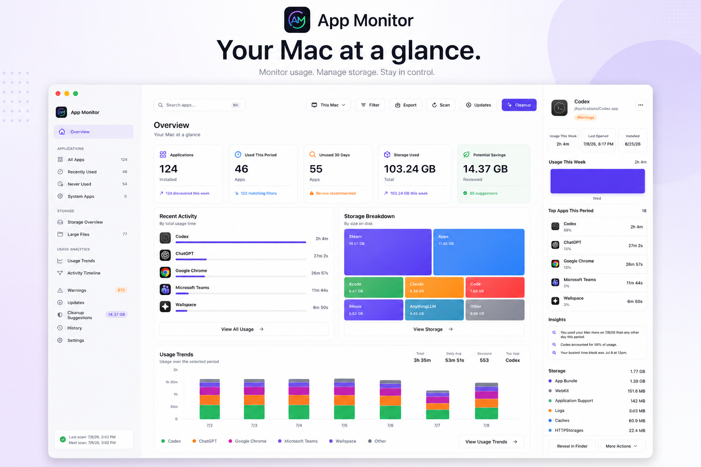
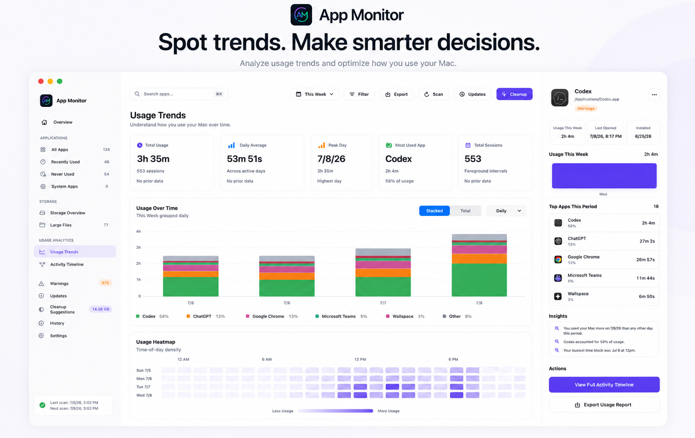
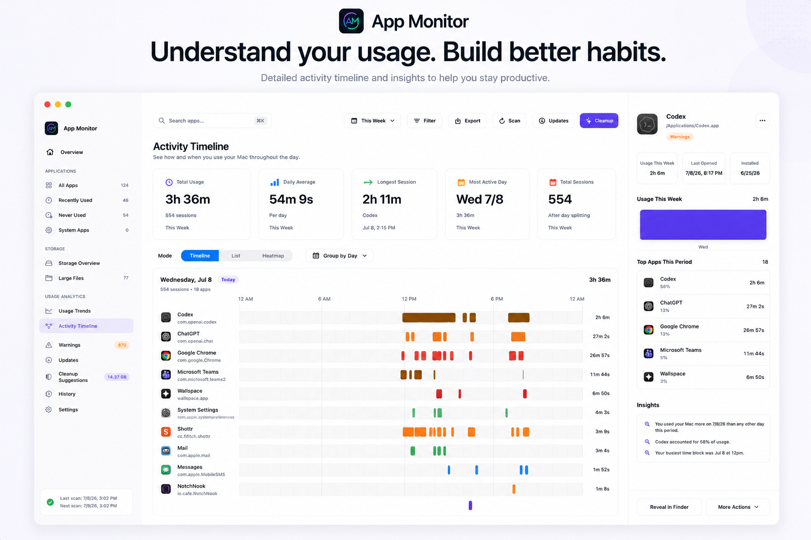
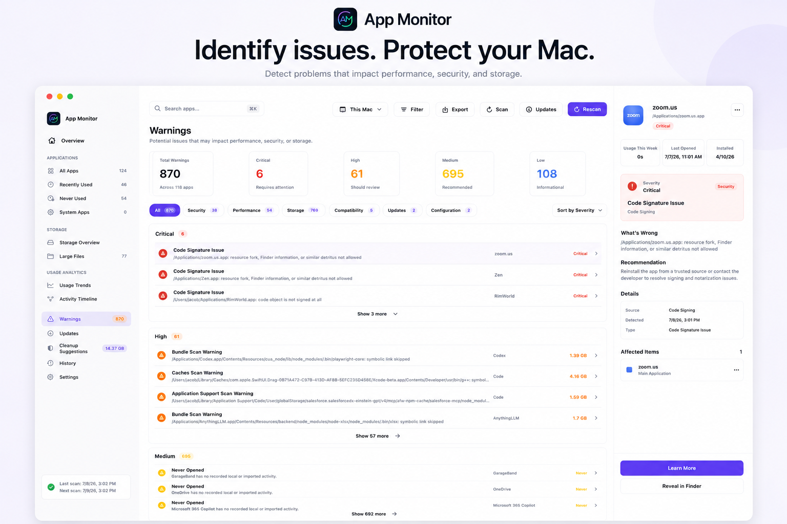
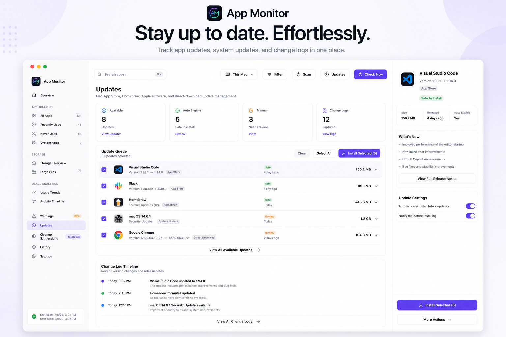
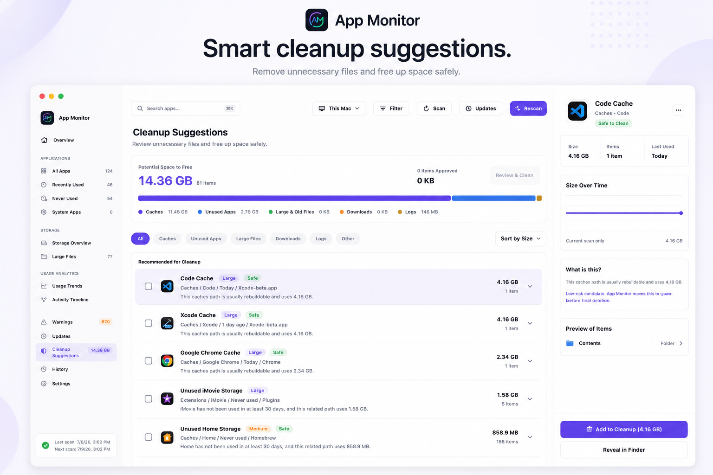
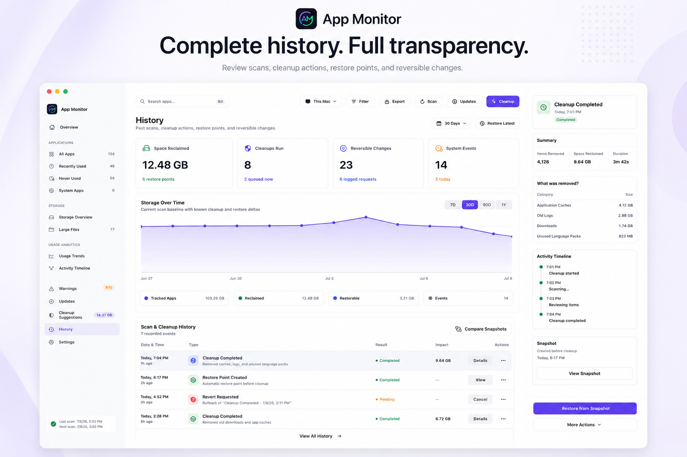

# App Monitor

App Monitor is a local-first macOS utility for understanding application usage, storage, cleanup opportunities, update status, and uninstall impact from one native SwiftUI dashboard.

The app is built as a Swift Package executable with a lightweight SQLite-backed core. It runs as a standard macOS app with an optional menu bar presence.

## Screenshots



| Usage Trends | Activity Timeline |
| --- | --- |
|  |  |

| Warnings | Updates |
| --- | --- |
|  |  |

| Quarantine Review | History |
| --- | --- |
|  |  |

## Features

- App inventory across common macOS application locations, with optional broader bundle discovery.
- Foreground app usage tracking with idle/session pause handling.
- Usage analytics for totals, daily trends, top apps, heatmaps, and timeline sessions.
- Spotlight usage import for historical last-used dates, use counts, and used days.
- Storage scans for app bundles and related Application Support, cache, container, preference, log, WebKit, cookie, and diagnostic paths.
- Quarantine review with exact-path preview, queued approval, restore, and action history flows.
- Large-file review and warning surfaces.
- App health checks for code signing, Gatekeeper, stale bundles, crashes, and permission-sensitive paths.
- Update checks for Mac App Store apps, Homebrew casks/formulae, Apple software updates, and direct-download apps with Sparkle feeds.
- Guided uninstall planning that moves selected app and support files to Trash.
- CSV exports for app tables, daily usage, timeline sessions, summaries, trend buckets, top apps, and heatmaps.

## How It Compares

App Monitor is meant to sit between usage trackers, cleanup tools, update checkers, and uninstall helpers:

- Compared with pure usage trackers, it keeps local foreground usage history alongside app storage and health context.
- Compared with cleaner apps, it defaults to review and quarantine instead of permanent deletion.
- Compared with uninstall tools, it shows an uninstall plan and affected paths before moving selected items to Trash.
- Compared with update checkers, it combines Mac App Store, Homebrew, Apple software update, and Sparkle/direct-download signals in one local view.

This category is crowded, so App Monitor's niche is the combination: usage history explains whether an app still matters, storage scans show what it owns, warnings flag review-worthy risk, updates show maintenance status, and quarantine-first cleanup keeps changes reversible. It is not trying to replace dedicated package managers, malware scanners, or deep disk visualizers. The goal is a native, local-first dashboard that makes app-related usage, storage, warnings, cleanup candidates, updates, and uninstall impact easier to inspect together.

## Requirements

- macOS 14 or newer.
- Xcode command line tools or Xcode with Swift 5.9 support.
- Optional: Homebrew and `mas` for Homebrew and Mac App Store update checks.

## Install Beta

Install the current Homebrew beta with:

```bash
brew install --cask jcranokc/tap/app-monitor@beta
```

Or tap first, then install:

```bash
brew tap jcranokc/tap
brew install --cask app-monitor@beta
```

The tap lives at [jcranokc/homebrew-tap](https://github.com/jcranokc/homebrew-tap).

## Build And Run

Run the test suite:

```bash
swift test
```

Build a runnable `.app` bundle:

```bash
./scripts/build_app.sh debug
```

Open the packaged app:

```bash
open "build/App Monitor.app"
```

Run the full local check used by this repo:

```bash
./scripts/ci
```

You can also run the Swift package executable directly during development:

```bash
swift run AppMonitor
```

Some macOS app behaviors, including bundle identity, icon resources, menu bar behavior, login item behavior, and permission prompts, are best exercised through the packaged app from `scripts/build_app.sh`.

## Packaging And Releasing

App Monitor's packaged app includes a GitHub-hosted appcast URL. Release packages include a zip, a branded drag-to-Applications DMG, SHA-256 checksums, and an `appcast.xml` file for update discovery.

For local packaging:

```bash
./scripts/package_release.sh 1.1.0 2
```

For a Homebrew beta cask, publish a versioned beta GitHub release and generate the cask file for a tap:

```bash
APP_MONITOR_TAG="v1.1.0-beta.2" ./scripts/package_release.sh 1.1.0 2
./scripts/generate_homebrew_beta_cask.sh 1.1.0 2
```

The unsigned/ad-hoc local package is useful for development. Public distribution should use Developer ID signing and Apple notarization so Gatekeeper can verify the app. See [RELEASING.md](RELEASING.md) for the exact commands, signing options, and local verification steps.

## Privacy

App Monitor is designed to run locally. It records app inventory, usage, storage scan, cleanup, uninstall, update, and settings data in a local SQLite database under `~/Library/Application Support/App Monitor/`.

It does not include telemetry, accounts, or a hosted backend. Optional update checks may contact third-party update sources or run local update tools such as Homebrew, `mas`, Apple `softwareupdate`, or app-provided Sparkle feeds. See [PRIVACY.md](PRIVACY.md) for details.

## Safety Notes

App Monitor can inspect local app-related storage and can move selected files to quarantine or Trash. Cleanup candidates are shown as a quarantine review: preview the exact path, queue only the items you approve, move them to App Monitor quarantine, and restore from History while the quarantined item remains available. Review cleanup and uninstall plans before applying them, especially for containers, preferences, Application Support data, and group containers that may contain user data.

Update installs may require administrator authorization or third-party package manager behavior outside this project.

## Project Structure

- `Sources/AppMonitor`: SwiftUI app, dashboard, menu bar UI, and app lifecycle wiring.
- `Sources/AppMonitorCore`: inventory, usage tracking, storage scanning, cleanup, update, uninstall, analytics, export, and SQLite logic.
- `Tests/AppMonitorCoreTests`: focused core behavior tests.
- `scripts/build_app.sh`: builds and signs a local `.app` bundle.
- `scripts/ci`: runs tests and verifies app bundle creation.

## License

App Monitor is released under the MIT License. See [LICENSE](LICENSE).
